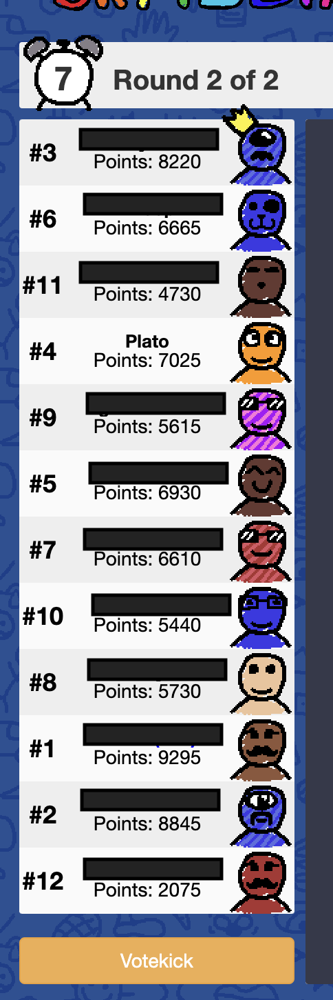

# skribbl.io scoreboard reader and parser using aws rekognition. 

### Setup
- Set up `venv`
- Install the dependencies from `requirements.txt`
- `python -m src.score_fetcher.main --image="<image filename.png>" --usernames="user1, user2, user3, user4, user5.... user 12....`

### Sample image to give as input


### Output
```
----------------------------
| Name            | Score  |
----------------------------
| user1           | 8220   |
| user2           | 6665   |
| user4           | 4730   |
| plato           | 7025   |
| user5           | 5615   |
| user6           | 6930   |
| user7           | 6610   |
| user8           | 5440   |
| user9           | 5730   |
| user10          | 9295   |
| user11          | 8845   |
| user12          | 2075   |
----------------------------
```